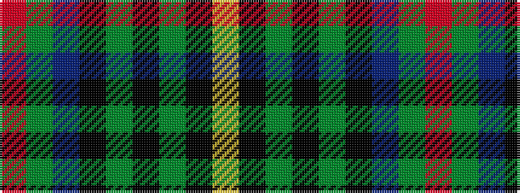

RGBKGKGKY

It is a 9 stripe tartan.

<figure class="pat-woven">

<figcaption>idealised sample</figcaption>
</figure>

## Colour Sequence



## Tartans with this colour sequence

| Tartans |
|---------------|
| [Trades House](/setts/s9/r2y2n9k10g12k1y1k1ly1~x4/)|
||
