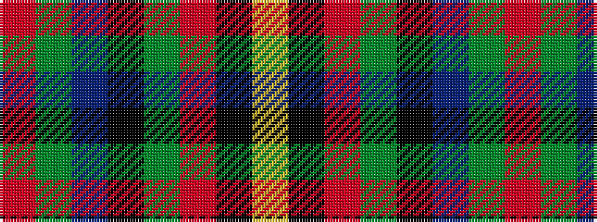

RGBKGRKY

It is a 8 stripe tartan.

<figure class="pat-woven">

<figcaption>idealised sample</figcaption>
</figure>

## Colour Sequence



## Tartans with this colour sequence

| Tartans |
|---------------|
| [Orkney](/variants/s8/m6y2db12k2y12m9k2lo2~x2/)|
||
| [Orkney (District?)](/variants/s8/r9g3b19k3g19r13k3lo3~x2/)|
||
| [Orkney District Tartan](/variants/s8/m3g1t6k1g6m4k1lo1~x4/)|
||
