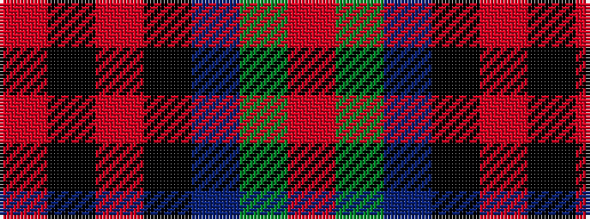

RGBKRKR

It is a 7 stripe tartan.

<figure class="pat-woven">

<figcaption>idealised sample</figcaption>
</figure>

## Colour Sequence



## Tartans with this colour sequence

| Tartans |
|---------------|
| [MacDuff](/variants/s7/r4k2r24k6db6g16r3~x2/)|
||
| [MacDuff #4](/variants/s7/r4k2r24k6db6dg16r3~x2/)|
||
