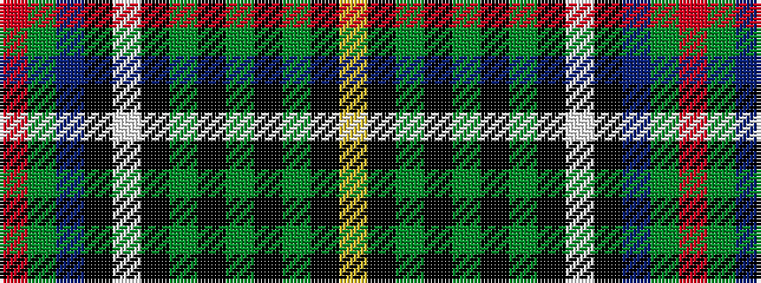

RGBKWKGKGKGKY

It is a 13 stripe tartan.

<figure class="pat-woven">

<figcaption>idealised sample</figcaption>
</figure>

## Colour Sequence



## Tartans with this colour sequence

| Tartans |
|---------------|
| [MacInnes](/variants/s13/r2dg6db12k3lb3k3dg16k2dg2k2dg2k12ly2/)|
||
