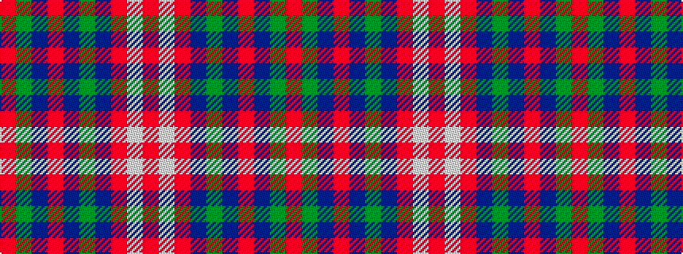

RGBRBGBRWR

It is a 10 stripe tartan.

<figure class="pat-woven">

<figcaption>idealised sample</figcaption>
</figure>

## Colour Sequence



## Tartans with this colour sequence

| Tartans |
|---------------|
| [Chisholm, The](/variants/s10/r12w2r37db6g3db3r4db3g21r4~x2/)|
||
| [Chisholm, The (MacGregor-Hastie)](/variants/s10/r12w2r37b6g3b3r4b3g21r4~x2/)|
||
