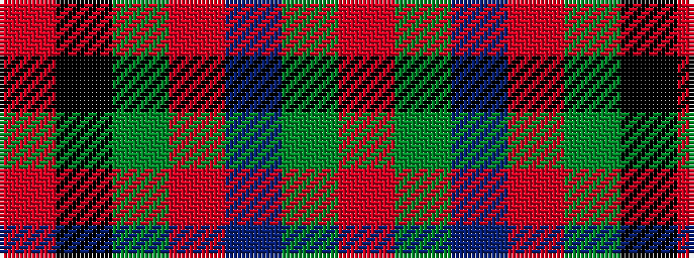

RGBRGKR

It is a 7 stripe tartan.

<figure class="pat-woven">

<figcaption>idealised sample</figcaption>
</figure>

## Colour Sequence



## Tartans with this colour sequence

| Tartans |
|---------------|
| [Stewart (Artefact)](/setts/s7/r2g4db8r9g9k2r2~x4/)|
||
| [Stewart, Plaid](/setts/s7/r2g4db8r9g9k2r2~x2/)|
||
