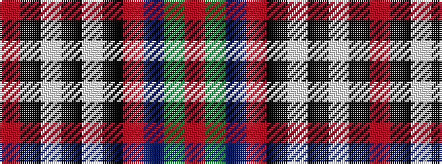

RGBRKWKWKR

It is a 10 stripe tartan.

<figure class="pat-woven">

<figcaption>idealised sample</figcaption>
</figure>

## Colour Sequence



## Tartans with this colour sequence

| Tartans |
|---------------|
| [Mitsukoshi Sendai](/variants/s10/o4k1w1k1w1k1o4n2dg6r1~x6/)|
||
