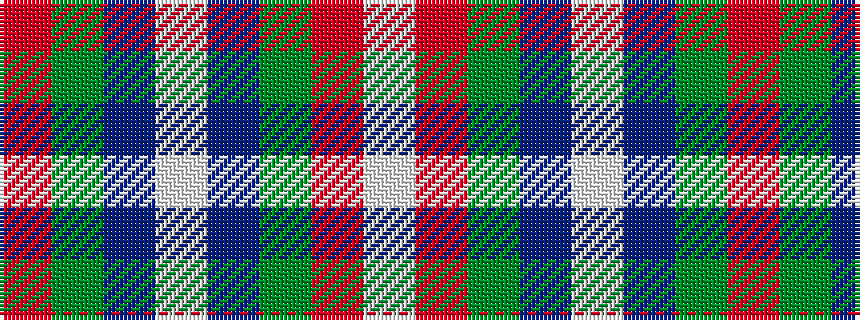

RGBWBGRW

It is a 8 stripe tartan.

<figure class="pat-woven">

<figcaption>idealised sample</figcaption>
</figure>

## Colour Sequence



## Tartans with this colour sequence

| Tartans |
|---------------|
| [Highland Spring Dress (2004)](/variants/s8/r25g10db30w4db30g10r25w2~x2/)|
||
