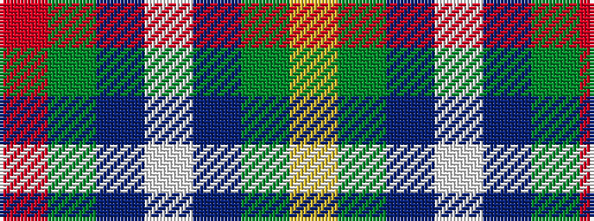

RGBWBGY

It is a 7 stripe tartan.

<figure class="pat-woven">

<figcaption>idealised sample</figcaption>
</figure>

## Colour Sequence



## Tartans with this colour sequence

| Tartans |
|---------------|
| [Newfoundland](/setts/s7/r6g4do14w4do7g30lo4~x2/)|
||
| [Newfoundland (District)](/setts/s7/r6dg4do14w4do7dg30lo4~x2/)|
||
