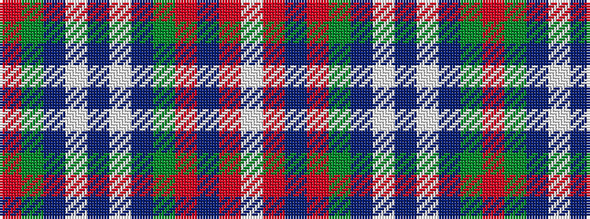

RGBWBWBGRBRW

It is a 12 stripe tartan.

<figure class="pat-woven">

<figcaption>idealised sample</figcaption>
</figure>

## Colour Sequence



## Tartans with this colour sequence

| Tartans |
|---------------|
| [Glen Moy #2](/setts/s12/o19dy2do3w1do1w1do1dy6o3do1o3w1~x4/)|
||
