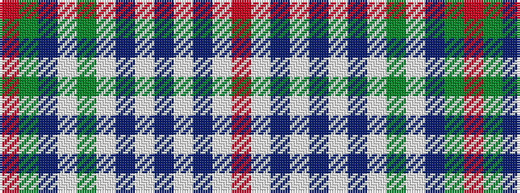

RGBWGWBWBWBWR

It is a 13 stripe tartan.

<figure class="pat-woven">

<figcaption>idealised sample</figcaption>
</figure>

## Colour Sequence



## Tartans with this colour sequence

| Tartans |
|---------------|
| [MacDonald, Flora (Dance)](/variants/s13/r3dg8db5w3dg20w3db5w3db5w22db3w8r3~x2/)|
||
