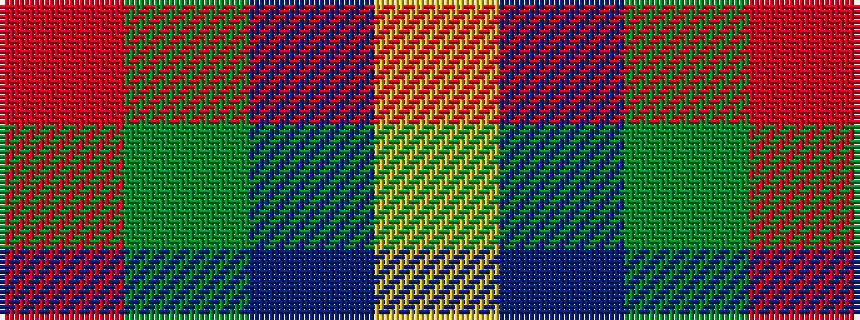

RGBY

It is a 4 stripe tartan.

<figure class="pat-woven">

<figcaption>idealised sample</figcaption>
</figure>

## Colour Sequence



## Tartans with this colour sequence

| Tartans |
|---------------|
| [MacLaine of Lochbuie](/variants/s4/r32g8t4ly1~x2/)|
||
| [MacLaine of Lochbuie](/setts/r32dg8b4ly1/)|
||
| [MacLaine of Lochbuie (Coburn)](/variants/s4/r32dg8t4ly1~x2/)|
||
