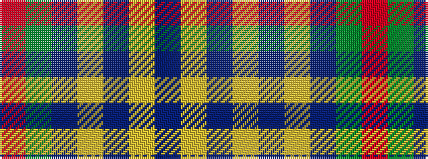

RGBYBYBY

It is a 8 stripe tartan.

<figure class="pat-woven">

<figcaption>idealised sample</figcaption>
</figure>

## Colour Sequence



## Tartans with this colour sequence

| Tartans |
|---------------|
| [Holden Monaro Corporate Tartan](/variants/s8/lr10dt3lr3dt3lr3dt11dy11o3~x2/)|
||
