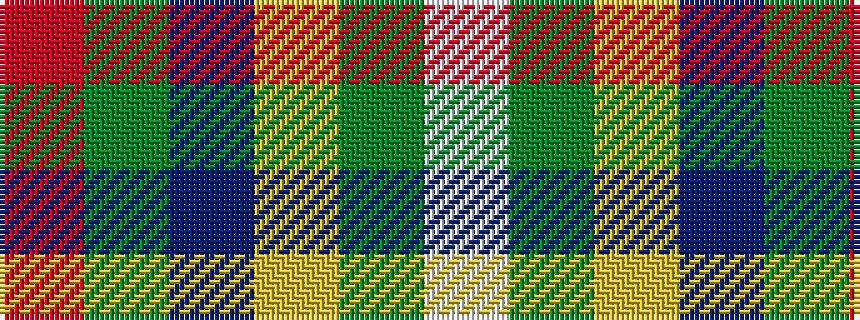

RGBYGW

It is a 6 stripe tartan.

<figure class="pat-woven">

<figcaption>idealised sample</figcaption>
</figure>

## Colour Sequence



## Tartans with this colour sequence

| Tartans |
|---------------|
| [Glencross (Tynron) (Personal)](/setts/s6/o3dgi13dt13lo2dg34w3~x2/)|
||
| [Glencross, Tynron (Name)](/setts/s6/r3y13db13ly2dg34w3~x2/)|
||
