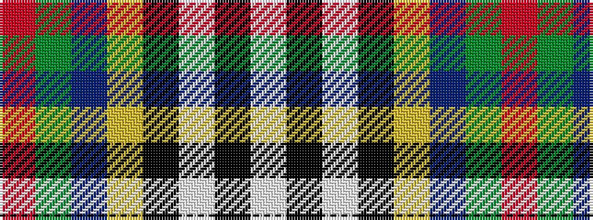

RGBYKWKW

It is a 8 stripe tartan.

<figure class="pat-woven">

<figcaption>idealised sample</figcaption>
</figure>

## Colour Sequence



## Tartans with this colour sequence

| Tartans |
|---------------|
| [Culloden - 2000 (Fashion)](/variants/s8/r4dy2t15ly2k14w14k2w4~x2/)|
||
| [Culloden Blue, Stirling](/variants/s8/r4dy2b15ly2k14w14k2w4~x2/)|
||
