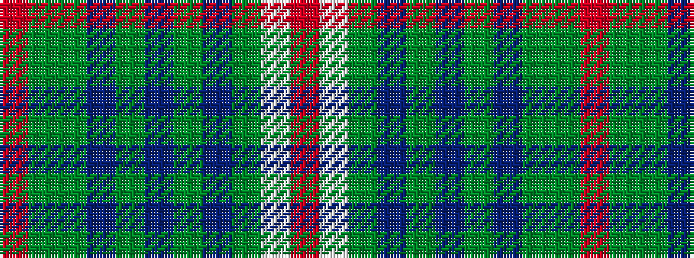

RGGBGBGBGWR

It is a 11 stripe tartan.

<figure class="pat-woven">

<figcaption>idealised sample</figcaption>
</figure>

## Colour Sequence



## Tartans with this colour sequence

| Tartans |
|---------------|
| [Wells (1970) (Name)](/setts/s11/o5w2g30db6g4db3g4db24g4dy5r3~x2/)|
||
