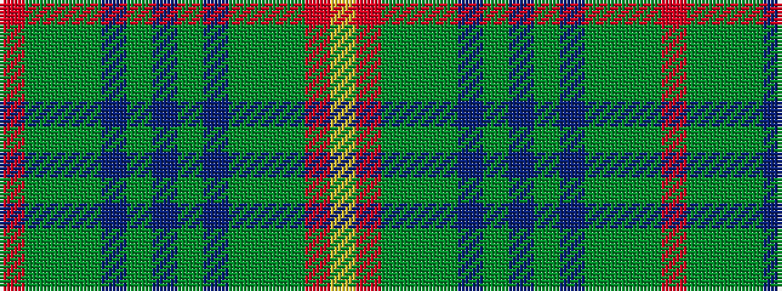

RGGGBGBGBGGGRY

It is a 14 stripe tartan.

<figure class="pat-woven">

<figcaption>idealised sample</figcaption>
</figure>

## Colour Sequence



## Tartans with this colour sequence

| Tartans |
|---------------|
| [Manitoba Province](/variants/s14/r12g1dg3g20t1g1t3g1t1g20dg3g1r12lo3~x4/)|
||
