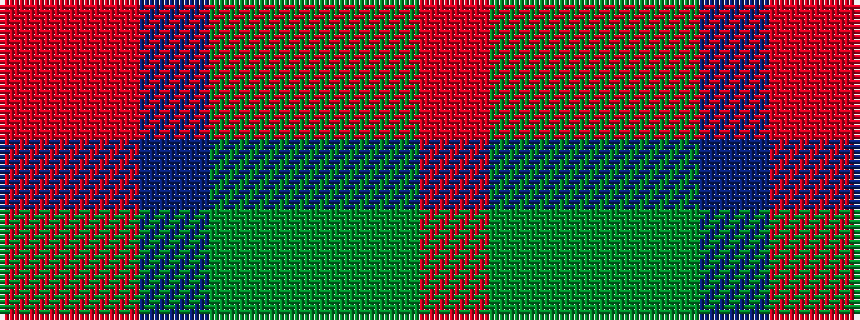

RGGGBRR

It is a 7 stripe tartan.

<figure class="pat-woven">

<figcaption>idealised sample</figcaption>
</figure>

## Colour Sequence



## Tartans with this colour sequence

| Tartans |
|---------------|
| [Lunting Papi (Personal)](/setts/s7/o5r8dp13dgi21dg34dgii55o3/)|
||
