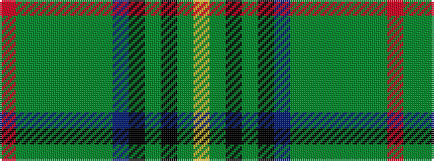

RGGGGGGBKGKGY

It is a 13 stripe tartan.

<figure class="pat-woven">

<figcaption>idealised sample</figcaption>
</figure>

## Colour Sequence



## Tartans with this colour sequence

| Tartans |
|---------------|
| [McHeadley Society](/setts/s13/r2dg18g2dg2g2dg2g12db3k13dg10k2g12ly2~x2/)|
||
