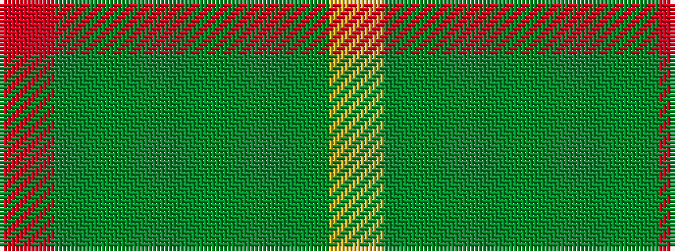

RGGGGGY

It is a 7 stripe tartan.

<figure class="pat-woven">

<figcaption>idealised sample</figcaption>
</figure>

## Colour Sequence



## Tartans with this colour sequence

| Tartans |
|---------------|
| [Hunting Kenmore](/setts/s7/r2dg19g2dg2g19dg2ly2~x2/)|
||
| [Kenmore Hunting](/setts/s7/r2g19g2g2g19g2lo2~x2/)|
||
