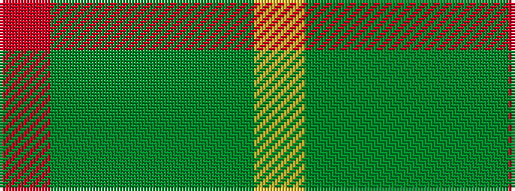

RGGGGY

It is a 6 stripe tartan.

<figure class="pat-woven">

<figcaption>idealised sample</figcaption>
</figure>

## Colour Sequence



## Tartans with this colour sequence

| Tartans |
|---------------|
| [Galloway](/setts/s6/r3dg1g32dg32g1ly3~x2/)|
||
| [Galloway Green (yellow line)](/setts/s6/r3gi2g32gi32g2ly3~x2/)|
||
