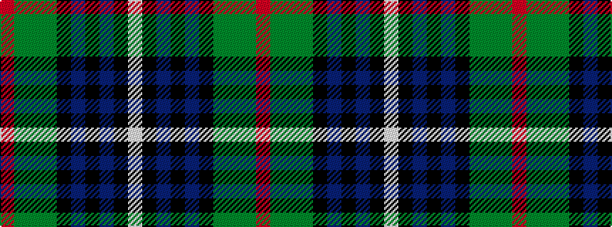

RGGGKBKBKW

It is a 10 stripe tartan.

<figure class="pat-woven">

<figcaption>idealised sample</figcaption>
</figure>

## Colour Sequence



## Tartans with this colour sequence

| Tartans |
|---------------|
| [McMeeken](/variants/s10/o7dg20y2dg4k5db4k2db20k3w1~x2/)|
||
