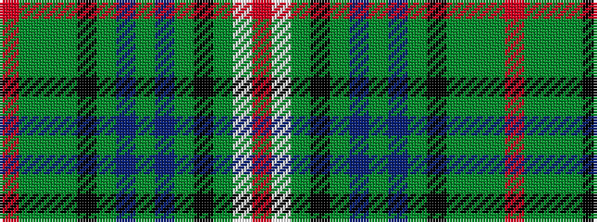

RGGGKGBGBGKGWR

It is a 14 stripe tartan.

<figure class="pat-woven">

<figcaption>idealised sample</figcaption>
</figure>

## Colour Sequence



## Tartans with this colour sequence

| Tartans |
|---------------|
| [Paget (Personal)](/setts/s14/r3g4y2g10k18g2dp18g3dp18g2k18g18w1r3~x2/)|
||
| [Paget Family Tartan Tartan Number: 2072. Earliest known date: 1992 Designed as a 'Family' tartan and woven by Peter MacDonald in Crieff. See products available Copyright © Blair Urquhart, Comrie, 2015](/setts/s14/r3g4g2g10k18g2db18g3db18g2k18g16w1r3~x2/)|
||
