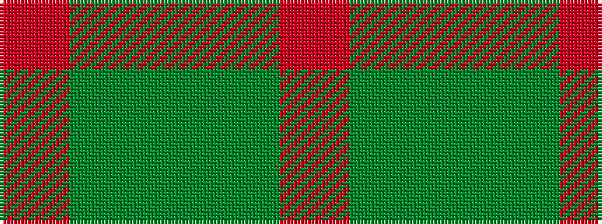

RGGGR

It is a 5 stripe tartan.

<figure class="pat-woven">

<figcaption>idealised sample</figcaption>
</figure>

## Colour Sequence



## Tartans with this colour sequence

| Tartans |
|---------------|
| [Belladrum Estate](/setts/s5/r4dg1yi6y3r2~x8/)|
||
