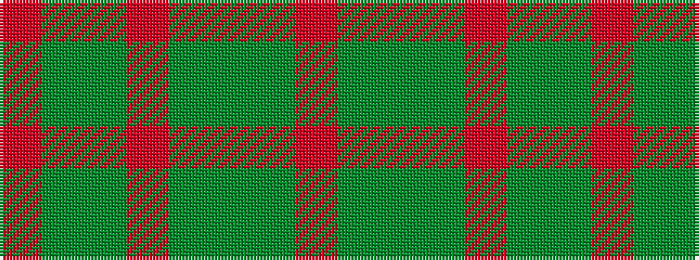

RGGGRGGR

It is a 8 stripe tartan.

<figure class="pat-woven">

<figcaption>idealised sample</figcaption>
</figure>

## Colour Sequence



## Tartans with this colour sequence

| Tartans |
|---------------|
| [Daks, Muted Loden](/setts/s8/o5g12dg4r4dg27g3dg4o5/)|
||
