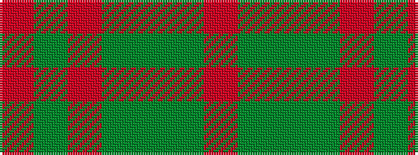

RGGGRGR

It is a 7 stripe tartan.

<figure class="pat-woven">

<figcaption>idealised sample</figcaption>
</figure>

## Colour Sequence



## Tartans with this colour sequence

| Tartans |
|---------------|
| [Caledonian Maple (Fashion)](/setts/s7/r11dg1r3y7dg7dy5o3~x4/)|
||
