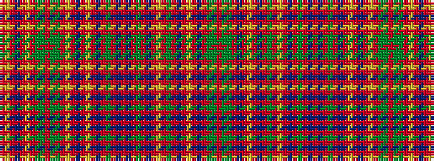

RGGRBRYRBRGRYRBRGRBRBRGRBRYRBRYRGGRGGRYRBRYR

It is a 44 stripe tartan.

<figure class="pat-woven">

<figcaption>idealised sample</figcaption>
</figure>

## Colour Sequence



## Tartans with this colour sequence

| Tartans |
|---------------|
| [MacAlister](/variants/s44/r8g1dg2r2b1r1lr1r1b1r2dg3r1lr1r6b1r1dg12r1b1r16b1r1dg12r1b1r6lr1r1db4r1lr1r2dg3g1r2g1dg3r3lr1r1db2r1lr1r8~x2/)|
||
