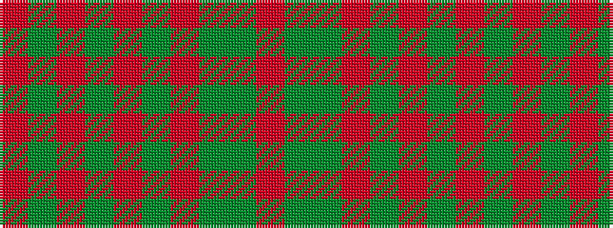

RGGRGRGRGR

It is a 10 stripe tartan.

<figure class="pat-woven">

<figcaption>idealised sample</figcaption>
</figure>

## Colour Sequence



## Tartans with this colour sequence

| Tartans |
|---------------|
| [Gray (Name)](/variants/s10/r3y33g10r3g3r3g3r8y10r3~x2/)|
||
