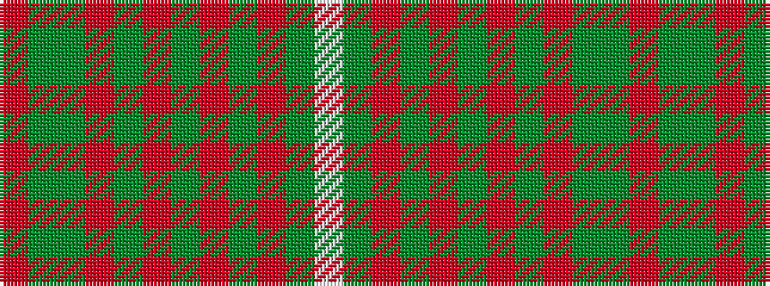

RGGRGRGRGRGW

It is a 12 stripe tartan.

<figure class="pat-woven">

<figcaption>idealised sample</figcaption>
</figure>

## Colour Sequence



## Tartans with this colour sequence

| Tartans |
|---------------|
| [Princess Marina](/variants/s12/r3dg18dg4r3dg4r5dg4r5dg4r5dg2w2~x2/)|
||
| [Princess Marina](/variants/s12/r3g18g4r3g4r5g4r5g4r5g2w2~x2/)|
||
