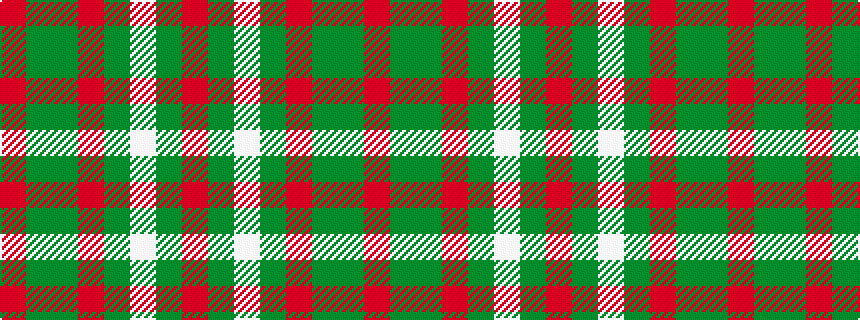

RGGRGWGR

It is a 8 stripe tartan.

<figure class="pat-woven">

<figcaption>idealised sample</figcaption>
</figure>

## Colour Sequence



## Tartans with this colour sequence

| Tartans |
|---------------|
| [Scott Htg (Clan)](/variants/s8/r3dy16g10r3g3lb2g3r3~x2/)|
||
| [Scott Htg (Error 2)](/variants/s8/r3dy16dy10r3dy3lb2dy3r3~x2/)|
||
