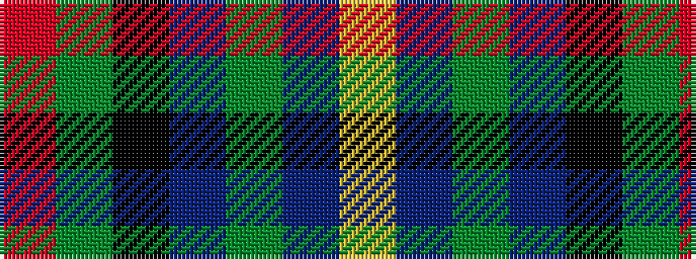

RGKBGBY

It is a 7 stripe tartan.

<figure class="pat-woven">

<figcaption>idealised sample</figcaption>
</figure>

## Colour Sequence



## Tartans with this colour sequence

| Tartans |
|---------------|
| [Junior Chamber International](/setts/s7/r4g16k16db4g3db12ly2~x2/)|
||
| [Junior Chamber International (Corp)](/setts/s7/r4dg16k16db4dg3db12lo2~x2/)|
||
