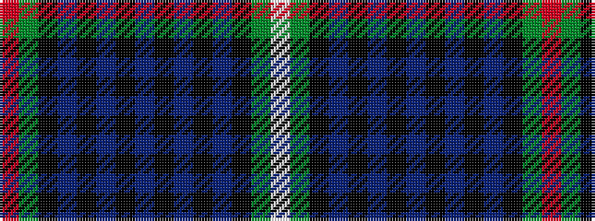

RGKBKBKBKBKBKGW

It is a 15 stripe tartan.

<figure class="pat-woven">

<figcaption>idealised sample</figcaption>
</figure>

## Colour Sequence



## Tartans with this colour sequence

| Tartans |
|---------------|
| [MacKenzie](/variants/s15/r1g11k4db2k1db1k1db14k1db1k1db2k4g11w1~x4/)|
||
