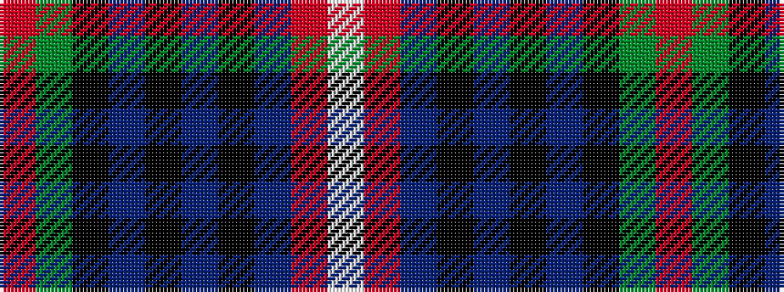

RGKBKBKBRW

It is a 10 stripe tartan.

<figure class="pat-woven">

<figcaption>idealised sample</figcaption>
</figure>

## Colour Sequence



## Tartans with this colour sequence

| Tartans |
|---------------|
| [McClafferty](/setts/s10/r3g10k12db3k2db2k2db30r4w1~x2/)|
||
