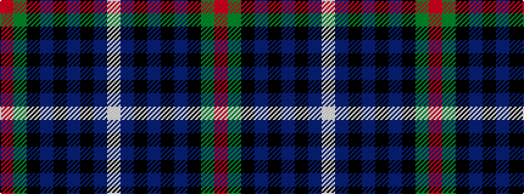

RGKBKBKBW

It is a 9 stripe tartan.

<figure class="pat-woven">

<figcaption>idealised sample</figcaption>
</figure>

## Colour Sequence



## Tartans with this colour sequence

| Tartans |
|---------------|
| [Scottish Chamber Orchestra](/variants/s9/lb3db20k3db2k5db2k3y15r2~x2/)|
||
| [Scottish Chamber Orchestra, The](/variants/s9/lt3dt20k3dt2k5dt2k3y15r2~x2/)|
||
