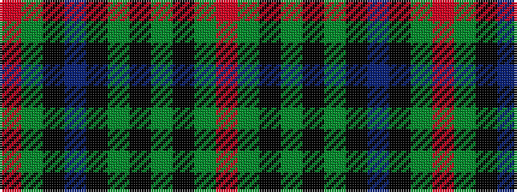

RGKBKGKGKGR

It is a 11 stripe tartan.

<figure class="pat-woven">

<figcaption>idealised sample</figcaption>
</figure>

## Colour Sequence



## Tartans with this colour sequence

| Tartans |
|---------------|
| [Rangers F.C.](/setts/s11/r3g14k12db40k12g2k2g2k2g7r3~x2/)|
||
| [Rangers F.C.](/setts/s11/r3g16k12db34k12g2k2g2k2g7r3~x2/)|
||
