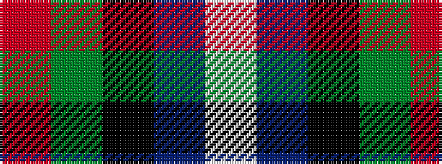

RGKBW

It is a 5 stripe tartan.

<figure class="pat-woven">

<figcaption>idealised sample</figcaption>
</figure>

## Colour Sequence



## Tartans with this colour sequence

| Tartans |
|---------------|
| [Dalmeny](/variants/s5/r4g15k15db15w4~x2/)|
||
| [Dalmeny #1](/variants/s5/r4dg15k15db15lb4~x2/)|
||
