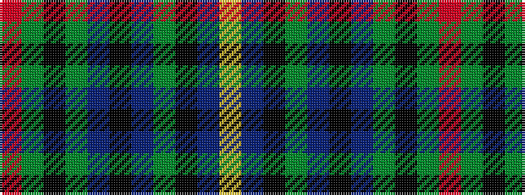

RGKGBKBGKBY

It is a 11 stripe tartan.

<figure class="pat-woven">

<figcaption>idealised sample</figcaption>
</figure>

## Colour Sequence



## Tartans with this colour sequence

| Tartans |
|---------------|
| [King (Personal)](/setts/s11/r3y2k1y2n26k12n4y15k1n1ly3~x2/)|
||
