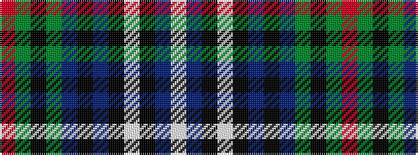

RGKGBKBKWKBW

It is a 12 stripe tartan.

<figure class="pat-woven">

<figcaption>idealised sample</figcaption>
</figure>

## Colour Sequence



## Tartans with this colour sequence

| Tartans |
|---------------|
| [Canmore Highland Games Dress](/setts/s12/w52db2k7w3k2dp2k1db9g8k2g3o2~x2/)|
||
