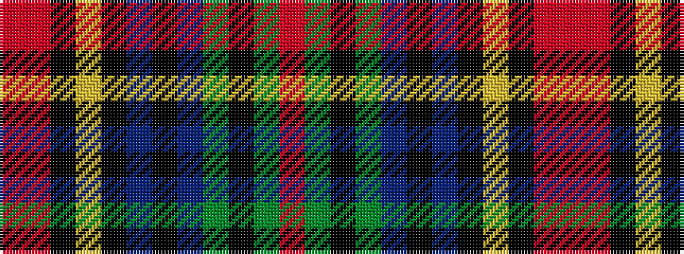

RGKGBKBKYKRR

It is a 12 stripe tartan.

<figure class="pat-woven">

<figcaption>idealised sample</figcaption>
</figure>

## Colour Sequence



## Tartans with this colour sequence

| Tartans |
|---------------|
| [Daks - Chino Check - B.11155](/setts/s12/o22o3k7ly2k2n2k2db10dy6k2dy3o2~x2/)|
||
