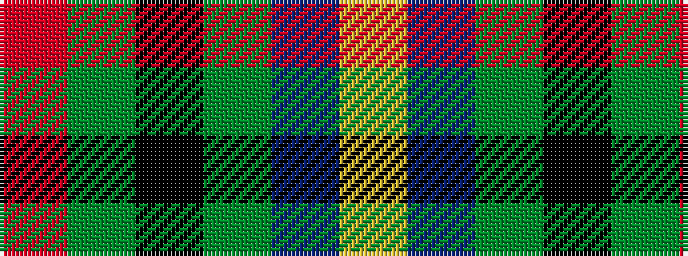

RGKGBY

It is a 6 stripe tartan.

<figure class="pat-woven">

<figcaption>idealised sample</figcaption>
</figure>

## Colour Sequence



## Tartans with this colour sequence

| Tartans |
|---------------|
| [Bobby Jones (Personal)](/setts/s6/r1dy2k12dy8db16lo1~x2/)|
||
| [Casely (Name)](/setts/s6/r4g11k11g2n11ly3~x4/)|
||
