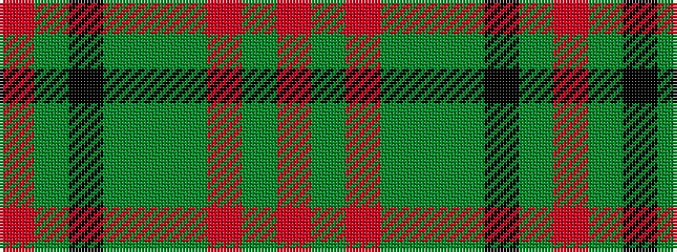

RGKGGGRGR

It is a 9 stripe tartan.

<figure class="pat-woven">

<figcaption>idealised sample</figcaption>
</figure>

## Colour Sequence



## Tartans with this colour sequence

| Tartans |
|---------------|
| [Battle of the Somme Centenary](/setts/s9/r3g24k4g10g3g10r5dy3o3~x2/)|
||
