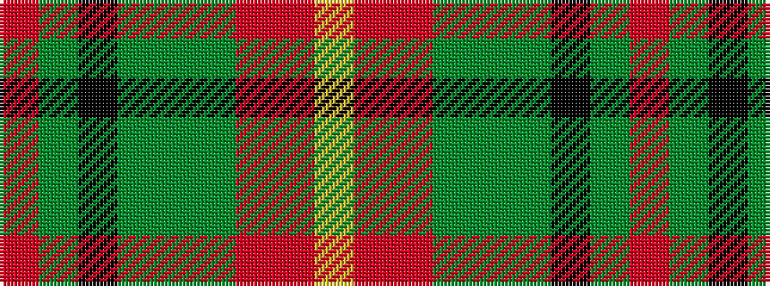

RGKGGGRRY

It is a 9 stripe tartan.

<figure class="pat-woven">

<figcaption>idealised sample</figcaption>
</figure>

## Colour Sequence



## Tartans with this colour sequence

| Tartans |
|---------------|
| [Battle of the Somme Centenary](/variants/s9/r3dg24k4dg10g3dg10r5o3lr3~x2/)|
||
