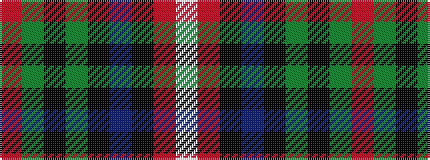

RGKGKBKRW

It is a 9 stripe tartan.

<figure class="pat-woven">

<figcaption>idealised sample</figcaption>
</figure>

## Colour Sequence



## Tartans with this colour sequence

| Tartans |
|---------------|
| [Wardrope (Personal)](/setts/s9/r3g32k4g4k11db3k7r4lb3/)|
||
