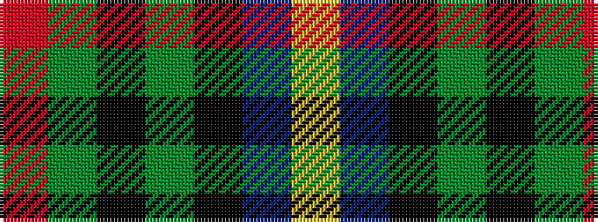

RGKGKBY

It is a 7 stripe tartan.

<figure class="pat-woven">

<figcaption>idealised sample</figcaption>
</figure>

## Colour Sequence



## Tartans with this colour sequence

| Tartans |
|---------------|
| [Livingstone MacLay MacLeay](/setts/s7/r28dg4k4dg4k4t6ly1~x2/)|
||
| [Livingstone, MacLay MacLeay](/setts/s7/r28g4k4g4k4t6ly1~x2/)|
||
| [MacLeay](/setts/s7/r27y4k4y4k4t6lo1~x4/)|
||
| [MacLeay (Clan)](/setts/s7/r27g4k4g4k4db6lo1~x4/)|
||
