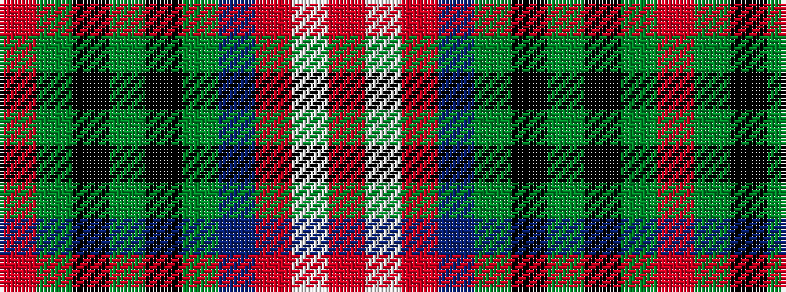

RGKGKGBRWR

It is a 10 stripe tartan.

<figure class="pat-woven">

<figcaption>idealised sample</figcaption>
</figure>

## Colour Sequence



## Tartans with this colour sequence

| Tartans |
|---------------|
| [Chisholm](/setts/s10/r6w1r24db6g2k1g2k1g12r1~x2/)|
||
| [Chisholm #2](/setts/s10/r6w1r24db6dg2k1dg2k1dg12r1~x2/)|
||
| [Chisholm VS](/setts/s10/r6lb1r24db6dg2k1dg2k1dg12r1/)|
||
