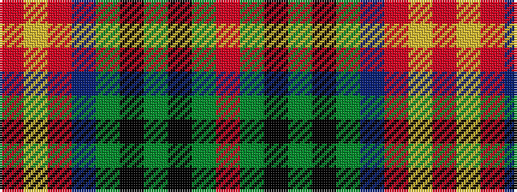

RGKGKGBRYR

It is a 10 stripe tartan.

<figure class="pat-woven">

<figcaption>idealised sample</figcaption>
</figure>

## Colour Sequence



## Tartans with this colour sequence

| Tartans |
|---------------|
| [Chisholm VS](/setts/r6lr1r24db6dg2k1dg2k1dg12r1/)|
||
