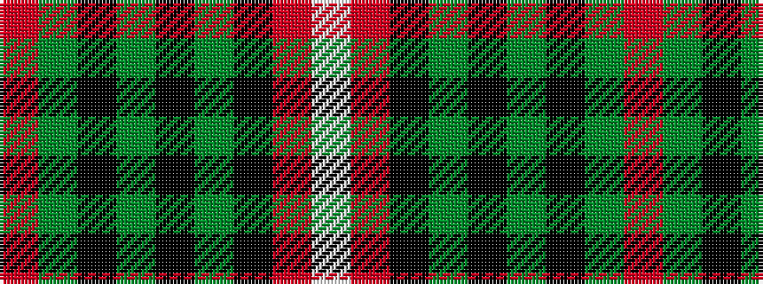

RGKGKGKRW

It is a 9 stripe tartan.

<figure class="pat-woven">

<figcaption>idealised sample</figcaption>
</figure>

## Colour Sequence



## Tartans with this colour sequence

| Tartans |
|---------------|
| [Hunter of Bute (Clan ?)](/variants/s9/r8dg8k1dg3k1dg1k10r20lb3~x2/)|
||
| [Stuart of Bute](/variants/s9/r12y6k1y2k1y1k6r24w2~x4/)|
||
| [Stuart of Bute](/variants/s9/r12dg6k1dg2k1dg1k6r24lb2~x2/)|
||
| [Stuart/Stewart of Bute](/setts/r12g6k1g2k1g1k6r24w2/)|
||
| [Stuart/Stewart of Bute Hunting](/variants/s9/m12dg6k1dg2k1dg1k6m24w2~x2/)|
||
| [Stuart/Stewart of Bute hunting](/variants/s9/m12g6k1g2k1g1k6m24w2~x2/)|
||
