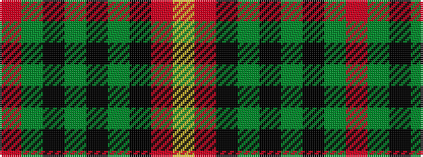

RGKGKGKRY

It is a 9 stripe tartan.

<figure class="pat-woven">

<figcaption>idealised sample</figcaption>
</figure>

## Colour Sequence



## Tartans with this colour sequence

| Tartans |
|---------------|
| [Stuart of Bute](/variants/s9/r12dg6k1dg2k1dg1k6r24lr2~x2/)|
||
