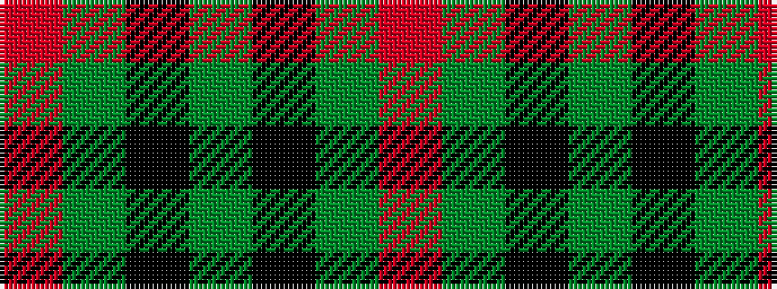

RGKGKGR

It is a 7 stripe tartan.

<figure class="pat-woven">

<figcaption>idealised sample</figcaption>
</figure>

## Colour Sequence



## Tartans with this colour sequence

| Tartans |
|---------------|
| [Duke of Sussex](/setts/s7/r18g1k5g1k1g1r9~x2/)|
||
| [Inverness Augustus](/setts/s7/m18dg1k5dg1k1dg1m9~x2/)|
||
| [Inverness, Augustus](/setts/s7/m18g1k5g1k1g1m9~x2/)|
||
