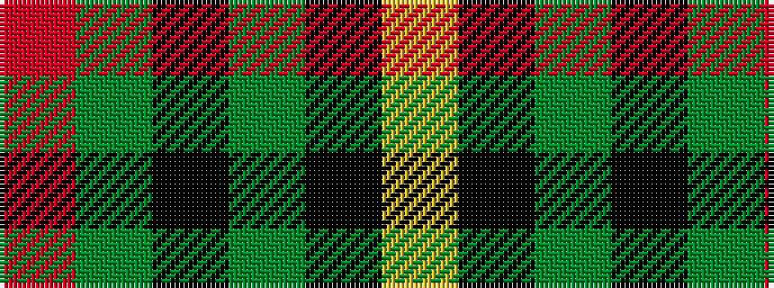

RGKGKY

It is a 6 stripe tartan.

<figure class="pat-woven">

<figcaption>idealised sample</figcaption>
</figure>

## Colour Sequence



## Tartans with this colour sequence

| Tartans |
|---------------|
| [Forbes](/variants/s6/r1g16k8g4k4ly1~x2/)|
||
| [Forbes #6](/variants/s6/r1dg16k8dg4k4ly1~x2/)|
||
| [Forbes VS](/setts/r1dg16k8dg3k4ly1/)|
||
| [MacArthur (Variant)](/variants/s6/r3g30k12g6k16ly2~x2/)|
||
| [MacArthur-Fox Htg (Personal)](/variants/s6/r3g30k12g1k16lo2~x2/)|
||
